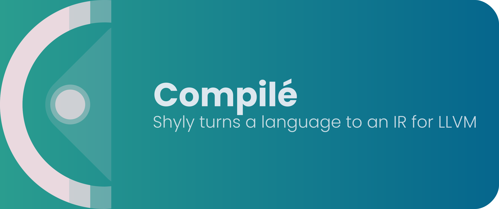

# 🗜️ Compilé

## 🎯 Goal

Create the front-end of a compiler for a fictional language, generating an IR (Intermediate Representation) recognized by LLVM, which will be used as the back-end.

## :scroll: Some details

This project was made using Python and some of its core libraries.

## :thinking: How do I run the project on my machine?

The first step is to clone the project, either via terminal or GitHub Desktop, or even by downloading the compressed file (.zip). After that, go ahead.

### :hammer_and_wrench: Requirements

- [Python](https://www.python.org/) version 3 or newer

### :mag: Installing dependencies

As only the core libraries were used, no dependencies need to be installed.

### :sparkles: Running project

With the terminal open in the project's root folder, you can run something similar to the following command:

> The `-f` or `--file` flag is used to specify the path of the file that will be analyzed and compiled into an IR.

```bash
python3 ./src/main.py -f ./samples/fibonacci.txt
```

### :tada: If everything went well...

Now you are running the project beautifully!

## 💻️ CLI

To know all the flags and their values that the compiler accepts, simply run the following command:

```bash
python3 ./src/main.py -h
```

## :memo: License

This project is under the MIT License v2.0 license. See the [LICENSE](LICENSE) for more information.

---

Made with 🖤 by [Gabriel Riquieri](https://www.linkedin.com/in/gabriel-riquieri-campos-ba1b411a7/), [Lucas Coutinho](https://www.linkedin.com/in/lucasmc64/) and [Amauri Pietropaolo](https://www.linkedin.com/in/amauri-pietropaolo-459503122/). :wave: Get in touch!
